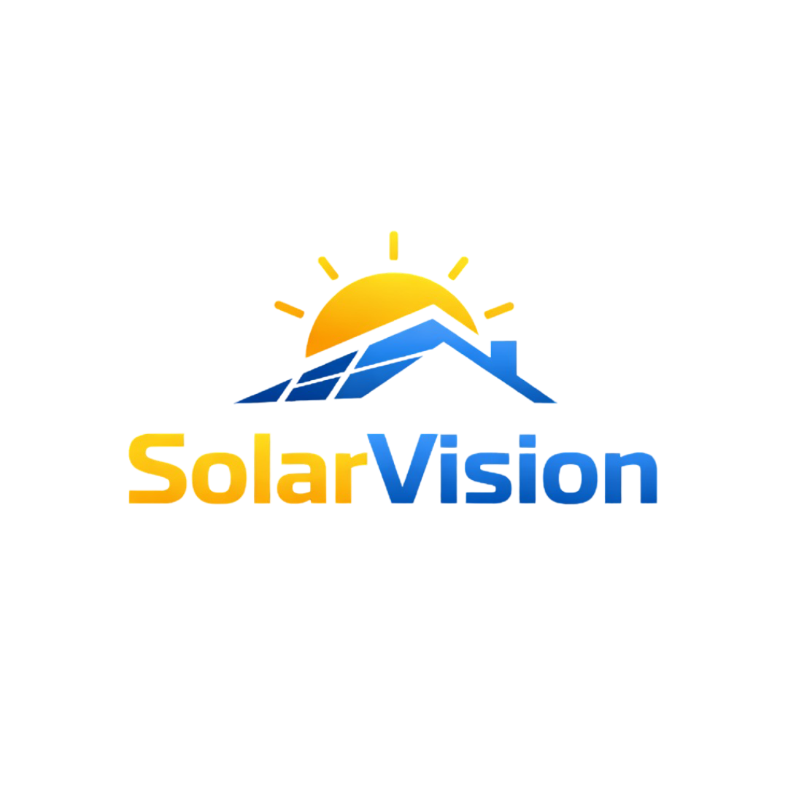
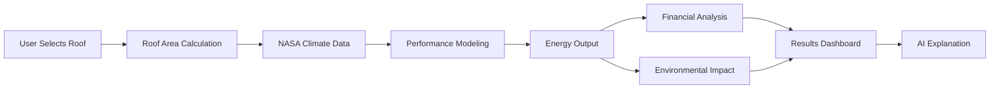

☀️ SolarVision

<p align="center">
  
</p>

<p align="center">
  <strong>AI-Powered Rooftop Solar Analysis Platform</strong><br/>
  Analyze rooftop solar potential instantly using <b>satellite data, climate intelligence, and AI</b>.
</p>

<p align="center">
  <a href="https://solarvision.vercel.app">🌐 Live Demo</a> -  
  <a href="https://github.com/Hamdan772/SolarVision">⭐ Star on GitHub</a>
</p>

<p align="center">
  
  
  
</p>

***

## 🎯 What is SolarVision?

**SolarVision** is a free, AI-powered web platform that helps homeowners, businesses, and policymakers instantly evaluate **rooftop solar potential** anywhere in the world.

### The Problem
Most people don't know whether solar is worth it for their specific roof. Traditional solar assessments are:
- 💸 **Expensive** — $100–$500 per consultation  
- 🔒 **Technical** — confusing jargon and spreadsheets  
- 🌍 **Limited** — unavailable in many regions  

### The Solution
SolarVision democratizes solar decision-making by combining:
- 🛰️ **Satellite imagery** for accurate rooftop selection  
- ☀️ **6 years of NASA climate data** for precise energy modeling  
- 🤖 **AI assistant** for personalized explanations  
- 📊 **Financial modeling** with ROI and payback calculations  
- ⚡ **Energy generation estimates**  
- 💰 **Financial ROI and payback periods**  
- 🌱 **Environmental impact metrics**

**Result:** Instant, accurate, and free rooftop solar analysis — anywhere.

***

## ✨ Features

| Feature | Description |
|----------|-------------|
| 🗺️ **Interactive Map** | Select rooftops using satellite imagery with OpenStreetMap building detection |
| ☀️ **Energy Analysis** | Monthly/annual energy generation using NASA POWER irradiance data |
| 💰 **Financial ROI** | Installation costs, payback period, 25-year savings projections |
| 🌱 **Impact Metrics** | CO₂ reduction, tree equivalents, sustainability visualization |
| 🤖 **AI Assistant** | Powered by Groq LLaMA 3.3 70B — ask questions in plain language |
| 📄 **PDF Reports** | Generate professional reports for presentations or financing |
| 🎨 **Premium UI** | Glass morphism, smooth animations, dark mode optimized |
| 🔄 **Expand Mode** | Full-screen analysis view with mini map sidebar |

***

## 🛠️ Tech Stack

| Layer | Technology |
|-------|-------------|
| Frontend | HTML5, CSS3, Vanilla JavaScript, Chart.js |
| Mapping | Leaflet.js, OpenStreetMap, Google Satellite |
| AI | Groq LLaMA 3.3 70B (via API) |
| Climate Data | NASA POWER API (6 years historical) |
| Backend | Python 3, Vercel Serverless Functions |
| PDF Generation | jsPDF, html2canvas |
| Deployment | [Vercel](https://solarvision.vercel.app) |

***

## 🏜️ UAE Climate Optimization

SolarVision is specifically tuned for **hot-desert environments** (UAE).

| Parameter | Value |
|-----------|-------|
| Electricity Rate | 0.38 AED/kWh (DEWA) |
| Temperature Derating | Dynamic monthly |
| Dust/Soiling Loss | 4% |
| Cloud Factor | 95% |
| Optimal Tilt | 25° |
| System Efficiency | 90% |

***

## 📊 How It Works



**Steps:**
1. Select rooftops using satellite imagery or manual drawing tools  
2. Calculate roof area and fetch climate data  
3. Perform energy modeling and financial analysis  
4. Generate environmental impact metrics and AI explanations  

***

## 🚀 Quick Start

<details>
<summary>Click to expand setup instructions</summary>

### Prerequisites
- Python 3.7+  
- Modern web browser  
- Optional: Groq API key for AI chat  

### Installation
```bash
# Clone the repository
git clone https://github.com/Hamdan772/SolarVision.git
cd SolarVision

# Install dependencies
pip install -r src/requirements.txt

# Start the server
python server_local.py
```

### Environment Variables (Optional)
```bash
GROQ_API_KEY=your_groq_api_key_here
```
> Get a free key at: [Groq Console](https://console.groq.com/)

### Local Access

| Page | URL |
|------|-----|
| Landing Page | http://localhost:8000/index.html |
| Calculator | http://localhost:8000/solar_advanced.html |
| AI Proxy | http://localhost:8000/api/groq |
</details>

***

## 🗺️ Roadmap

<details>
<summary>Show Development Phases</summary>

### ✅ Phase 1 — Complete
- UAE-optimized solar calculator  
- Satellite rooftop selection  
- AI assistant with Groq  
- Financial & environmental analysis  
- PDF report generation  
- Premium glass UI  

### 🚧 Phase 2 — 2026
- Global region support  
- Progressive Web App (PWA)  
- Shading & obstruction analysis  
- Mobile optimization  

### 🔮 Phase 3 — Future
- Battery storage recommendations  
- 3D roof modeling  
- Installer marketplace  
- Real-time energy monitoring  
</details>

***

## 🌍 UN Sustainable Development Goals

| Goal | Description |
|------|--------------|
| **SDG 7** | Affordable & Clean Energy |
| **SDG 11** | Sustainable Cities & Communities |
| **SDG 12** | Responsible Consumption |
| **SDG 13** | Climate Action |

***

## 🤝 Contributing

1. Fork the repository  
2. Create a feature branch  
   ```bash
   git checkout -b feature/amazing-feature
   ```
3. Commit your changes  
   ```bash
   git commit -m 'Add amazing feature'
   ```
4. Push to the branch  
   ```bash
   git push origin feature/amazing-feature
   ```
5. Open a Pull Request  

***

## 🙏 Acknowledgments

- **NASA POWER** — Climate and irradiance data  
- **OpenStreetMap** — Building footprint data  
- **Groq** — Ultra-fast AI inference  
- **Leaflet.js** — Open-source mapping  

***

## 📝 License

This project is licensed under the **MIT License**. See [LICENSE](LICENSE) for details.

<p align="center">
  <strong>⭐ Star this repo if you find it useful!</strong><br/>
  Built with ☀️ for a sustainable future.
</p>
